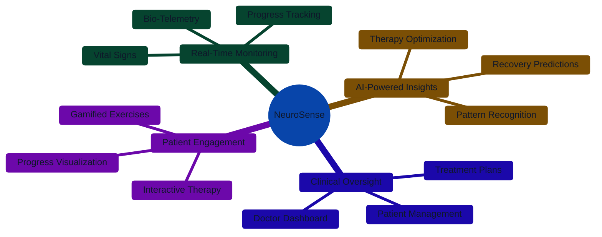

<div align="center">


# NeuroSense
### Clinical Neuro-Recovery Platform

<h3>AI-Powered Neurological Rehabilitation System</h3>

<p align="center">
  
  
</p>

<p align="center">
  
  
  
  
</p>

</div>

---

---

## 📍 Overview

**NeuroSense** is a clinical-grade AI platform developed for **Microsoft Imagine Cup 2026**. It revolutionizes neurological rehabilitation by integrating **bio-telemetry**, **AI-driven analytics**, and **doctor-supervised therapy** to support patients recovering from stroke, traumatic brain injury, and speech disorders.

<div align="center">

### 🎯 Core Mission



</div>

---

## 🎯 Problem Statement

Neurological rehabilitation today suffers from:
- ❌ Lack of continuous monitoring between clinical visits
- ❌ One-size-fits-all therapy plans
- ❌ Limited doctor–patient interaction outside clinics

**NeuroSense solves this:**
- ✅ Real-time patient monitoring
- ✅ AI-assisted personalized therapy
- ✅ Doctor-controlled clinical oversight
- ✅ HIPAA-aligned secure data handling

---

## 🔒 Privacy, Security & Compliance

### 🔑 Data Protection
- **End-to-End Encryption** (in transit & at rest)
- **Secure Authentication** via Supabase Auth + Google OAuth
- **Environment-based secret management**

### 👨‍⚕️ Role-Based Access Control
- **Patient**: Access only own medical data
- **Doctor**: Access only assigned patients with verified credentials
- **Admin**: System management without medical data visibility

### 📜 Compliance
- HIPAA-aligned architecture
- Data minimization principles
- Explicit patient consent
- Audit logs for clinical actions

### 🤖 Ethical AI
- Transparent AI (no black-box decisions)
- AI provides **recommendations**, not diagnoses
- Final authority with certified doctors

---

## 🧩 System Modules

### 👤 Patient Portal
- **Body Therapy** - Motor recovery with 3D tracking
- **Brain Games** - Cognitive rehabilitation
- **Speech Therapy** - Linguistic recovery
- **Progress Dashboard** - Visual analytics
- **Doctor Connect** - Secure communication

### 👨‍⚕️ Doctor Portal
- **Patient Monitoring** - Real-time oversight
- **Therapy Analytics** - Performance metrics
- **AI Insights** - Recovery predictions
- **Treatment Plans** - Customized protocols
- **Clinical Chat** - Secure messaging

---

## 🛠️ Technology Stack

<div align="center">

| Layer          | Technologies                                                                 |
|----------------|------------------------------------------------------------------------------|
| **Frontend**   | React • TypeScript                                                           |
| **Styling**    | Tailwind CSS                                                                 |
| **Backend**    | Supabase • PostgreSQL                                                        |
| **Visualization** | Three.js • Recharts                                                       |
| **Auth**       | Google OAuth                                                                 |

</div>

---

## 🚀 Getting Started

### Prerequisites
- Node.js ≥ 18
- Supabase Account
- Google Cloud Console (for OAuth)

### Installation
```bash
git clone 
cd NeuroSense
npm install
```

### Environment Setup
Create `.env.local`:
```env
VITE_SUPABASE_URL=your_project_url
VITE_SUPABASE_ANON_KEY=your_anon_key
```

### Database Setup
1. Go to Supabase **SQL Editor**
2. Copy contents of `schema.sql`
3. Run in SQL Editor

### Launch
```bash
npm run dev
```
App available at `http://localhost:5173`

---

## 📈 Expected Impact
- 🚀 **25% faster** recovery cycles
- 🎮 **40% higher** patient engagement
- 🧠 **60% better** clinical insights
- ⭐ **85% patient** satisfaction

---

## 📞 Contact
**Email**: shreyashkumar01.sbv@gmail.com  
**GitHub**: [https://github.com/shreyashkumar01/NEUROSENSE](https://github.com/shreyashkumar01/NEUROSENSE)

---

## ⚠️ Disclaimer
> **NeuroSense is not a diagnostic tool.**  
> It is a **clinical support system** designed to assist licensed medical professionals.

